# Links

WEBSITE LINK: https://mitchellfernandez.vercel.app/index.html

GITHUB LINK: https://github.com/Mfern10/Portfolio

YOUTUBE PRESENTATION LINK: https://youtu.be/UlxWyVOt7B8

# Purpose

I wanted to make my portfolio website very simple to navigate and read with a focus on minimalistic colours and properties.
The design is meant to be soft on the eyes of the user and straight to the point of information. I wanted to convery my portfolio website from my own design factors something that portrayed myself and my style to others.

# Functionality/features

My portfolio website utilizes a simple navigation bar that is responsive to all devices. Turning into a drop down checkbox menu 
when in mobile and tablet view mode. The navigation then extends as a inline menu for desktop and larger tablets.

The site consists of 6 HTML pages each connecting to there own CSS file. (INDEX/HOME, ME, PORTFOLIO, BLOG, BLOG POSTS and a CONTACT page).
Each page contains the navigation bar and footer with social icon links.

The Home page contains a photo of myself and a short welcome message and my role. 

The ME page contains a Description of myself and a link to my resume that is Downloadable from clicking.

The PORTFOLIO page contains github icon image thats clickable to take you to my github repository for my portfolio, I have also added that more work will be added and is coming soon. 

The BLOG page shows a list of 2 blogs with picturs title and date published. The first blog is clickable which will take you to a page of blog post for that blog. each post containing an
image and date published and some place holder text. 

The contact page contains a form that when filled out will send an email to my personal email account use www.formspree.com.

# Site Map

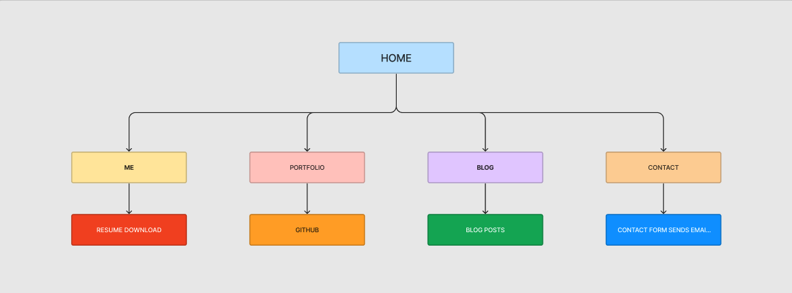

# Screenshots

I have included a Screenshot of each page and its mobile version.

## HOME/INDEX
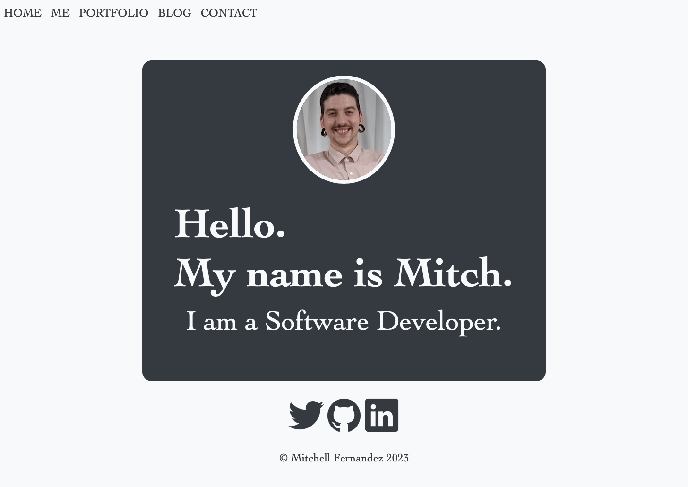
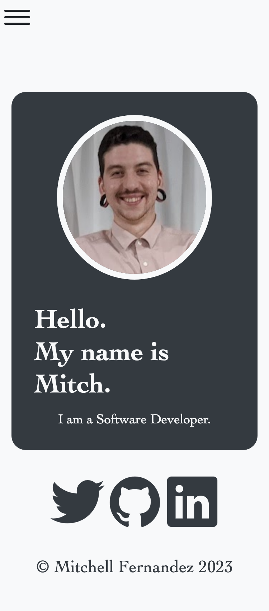

## ME
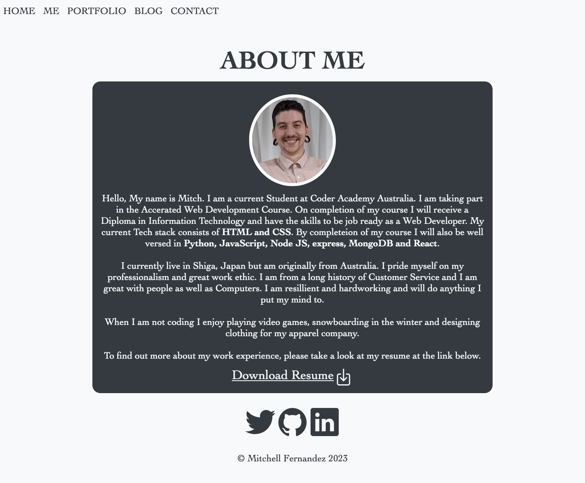

## PORTFOLIO
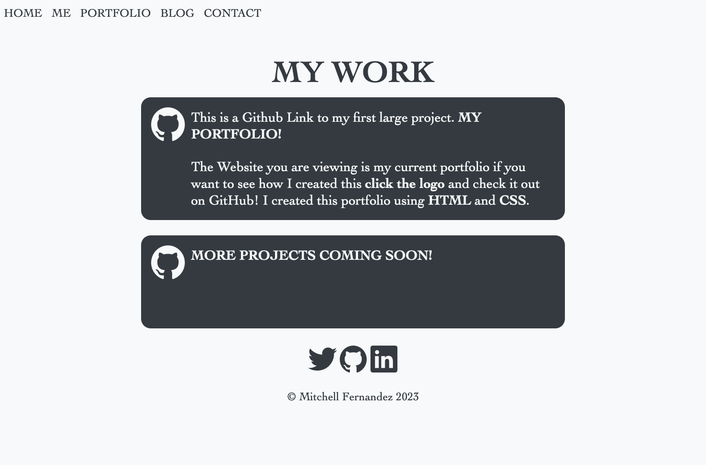
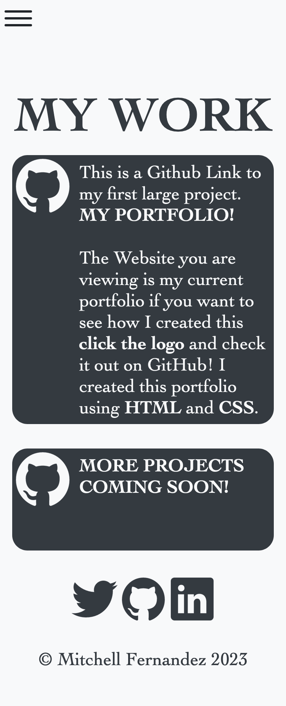

## BLOG
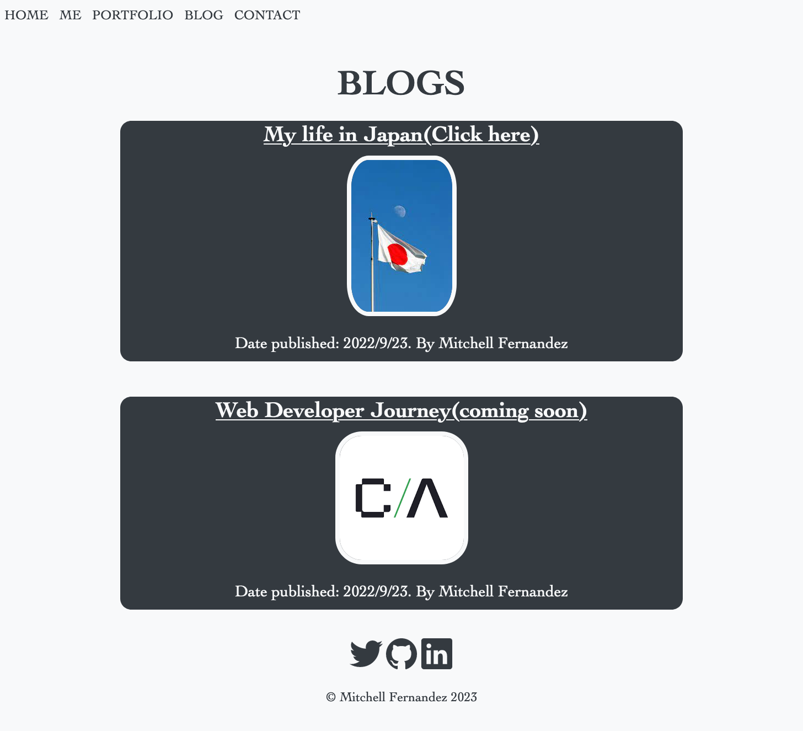
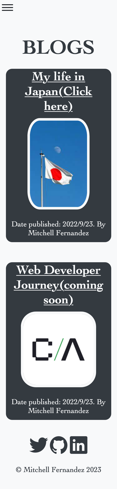

## BLOG POSTS
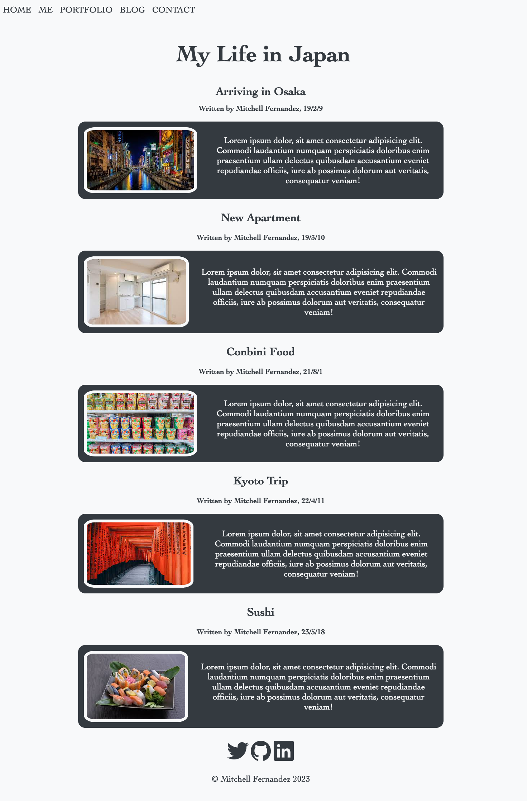

## CONTACT
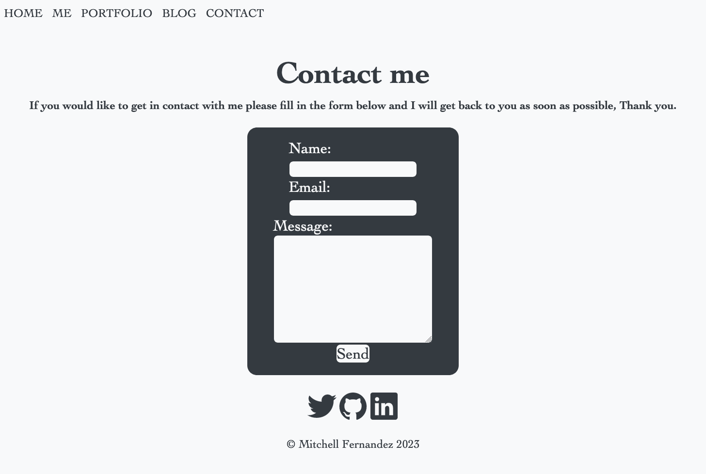
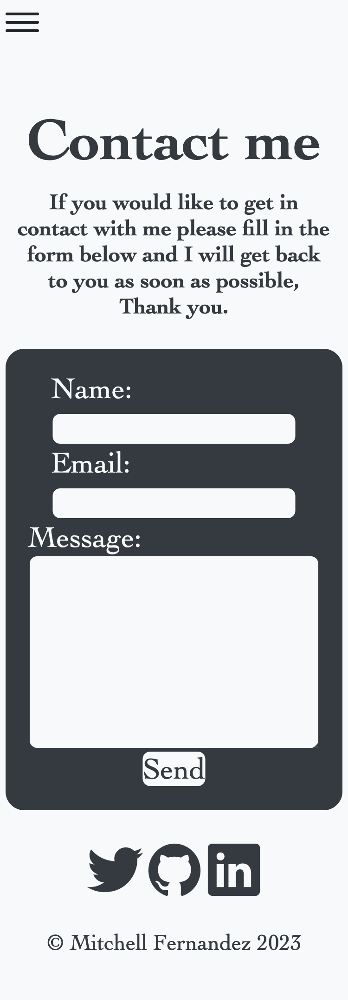

## Mobile Naviagtion
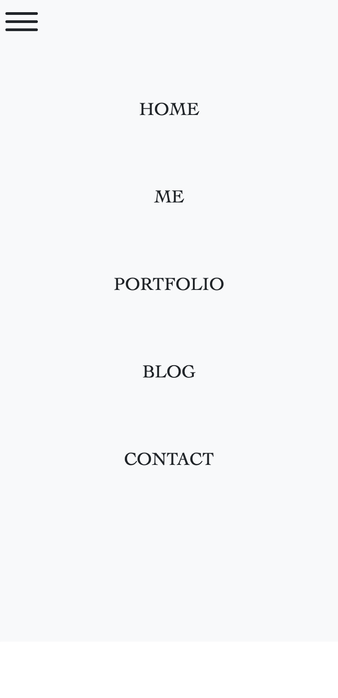

# Wireframes
## Home
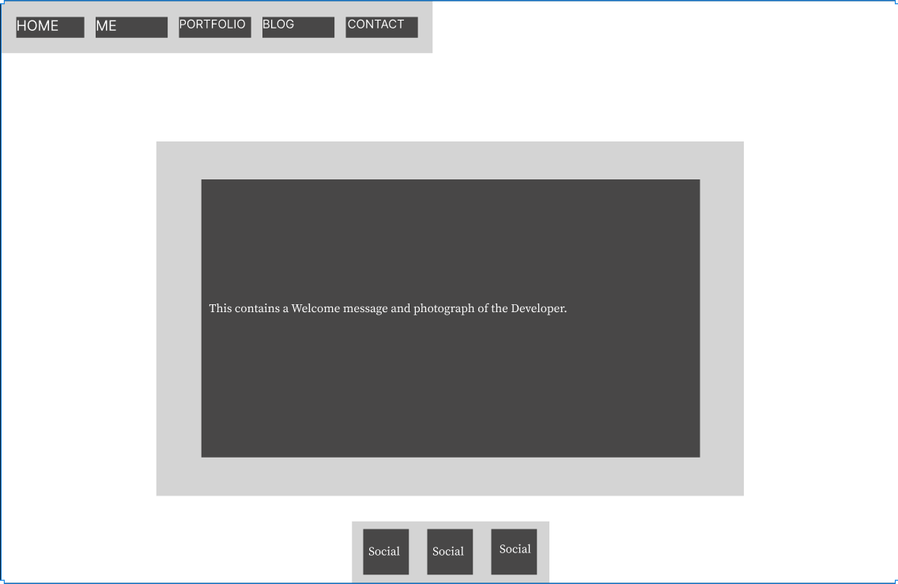
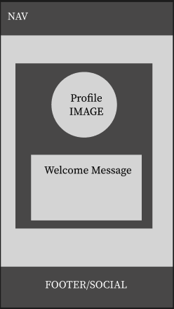

## Mobile Navigation 
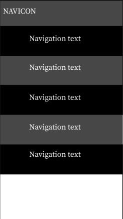

## ME
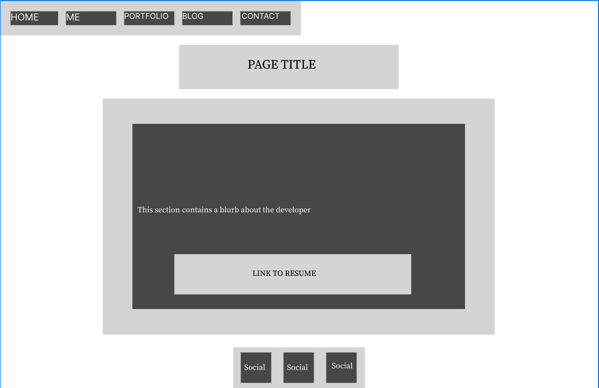

## PORTFOLIO
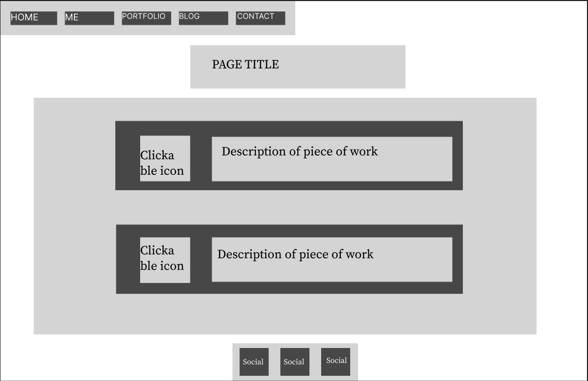

## BLOG LIST
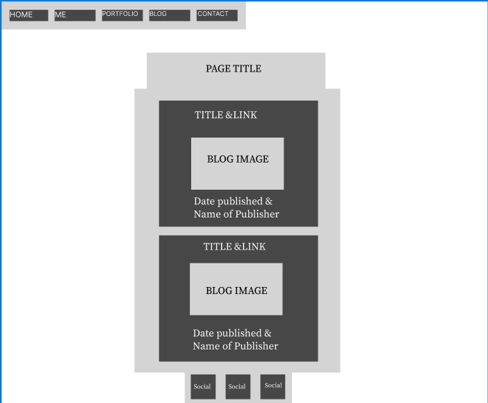

## BLOG POSTS

## CONTACT
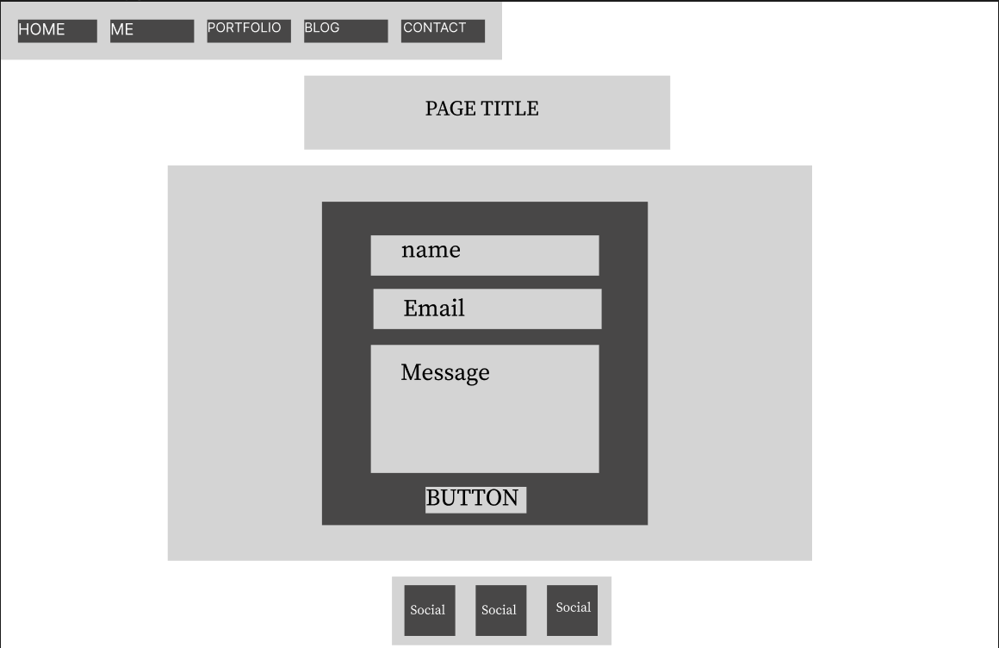

# Target Audience 

The Target audience for my portfolio is potential employers. and educators to assess my HTML and CSS ability. The design needed to look professional but minimal. 

# Tech stack 

- HTML
- CSS
- GitHub
- Vercel
- formspree.com
- ionic.io